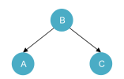
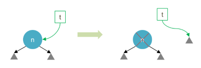
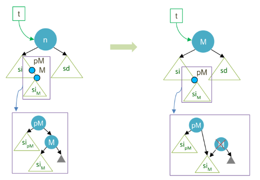

# Árbol de Binario Ordenado

En la [introducción a los árboles](./intro_arboles.md) presentamos la estructura básica de árboles binarios. Ahora, vamos a introducir un tipo especial de árbol binario llamado **Árbol de Binario Ordenado** o **Árbol Binario de Búsqueda** (_Binary Search Tree, BST_). En un BST, cada nodo tiene un valor, y todos los nodos a la izquierda de un nodo tienen valores menores, mientras que todos los nodos a la derecha tienen valores mayores.



Nuestro árbol deberá respetar entonces la relación de orden donde: `dato_A < dato_B < dato_C`.

> En un árbol binario ordenado, al igual que con cualquier estructura que puede ordenarse, la abstracción representada en cada nodo debe poder asociar sus elementos a través de una **relación de orden**.

## Implementación

Podemos definir un BST de manera similar a un árbol binario, pero con la adición de reglas para la inserción y eliminación de nodos. La estructura sigue siendo la misma, por lo cual podríamos definirlo como una especialización del árbol binario básico.

```python
from typing import TypeVar
from arbol_binario import ArbolBinario, NodoAB

class Comparable(Protocol):
    def __lt__(self: 'T', otro: 'T') -> bool: ...
    def __le__(self: 'T', otro: 'T') -> bool: ...
    def __gt__(self: 'T', otro: 'T') -> bool: ...
    def __ge__(self: 'T', otro: 'T') -> bool: ...
    def __eq__(self: 'T', otro: 'T') -> bool: ...
    def __ne__(self: 'T', otro: 'T') -> bool: ...

T = TypeVar('T', bound=Comparable)

class NodoABO(NodoAB[T]):
    def __init__(self, dato: T):
        super().__init__(dato)
    
    def __lt__(self, otro: "NodoABO[T]") -> bool:
        return isinstance(otro, NodoABO) and self.dato < otro.dato
    
    def __gt__(self, otro: "NodoABO[T]") -> bool:
        return isinstance(otro, NodoABO) and self.dato > otro.dato

    def __eq__(self, otro: "NodoABO[T]") -> bool:
        return isinstance(otro, NodoABO) and self.dato == otro.dato

class ArbolBinarioOrdenado(ArbolBinario[T]):
    ...
```
La extensión de `NodoAB` se hace necesaria ya que en este tipo de árboles necesitamos nodos _comparables_, donde tengan una relación de orden. Por eso se incoporan los métodos correspondientes de comparación en el nodo propio `NodoABO`, el cual contendrá algún tipo de dato `T` que también sea comparable. 

Si bien estamos tratando **anotaciones de tipo** y no precisamente declaraciones en un lenguaje tipado como Java, podemos mejorar la documentación del tipo de dato esperado para `T` (comparable) utilizando la clase base [typing.Protocol](https://docs.python.org/3/library/typing.html#typing.Protocol) que nos ayuda a establecer un subtipado estructural para simular la interfaz `Comparable<T>` en Java. Luego, sólo se debe acotar la variable de tipo `T` cuando se define en `TypeVar` con el parámetro `bound`.

> La idea de usar `Protocol` puede resultar útil para documentar o mejorar la interpretabilidad, pero en la práctica podría generar otros problemas. Por ejemplo, los tipos nativos como `int` no implementan explícitamente los métodos de comparación, por lo cual el analizador de anotaciones nos generará un error porque `int` no se adecúa al protocolo de nuestra `Comparable`.

Continuando con la consutrucción, recordemos que en nuestro árbol binario la realizábamos con un método estático `crear_nodo()` que devuelve una instancia de `ArbolBinario[T]`. Así que debemos ocultar este método en nuestra clase especializada para que construya un objeto de tipo `ArbolBinarioOrdenado` con su propio `NodoABO`. Para evitar acoplar demasiado la subclase, lo implementaremos sin acceder directamente a los atributos.

```python
@staticmethod
def crear_nodo(dato: T) -> ArbolBinarioOrdenado[T]:
    nuevo = ArbolBinarioOrdenado()
    nuevo.set_raiz(NodoABO(dato))
    return nuevo
```
Las operaciones `set_raiz()`, `insertar_si()` e `insertar_sd()`, permiten encapsular mejor la estructura de la superclase para reducir el acoplamiento natural de la herencia.

### Especializaciones de `ArbolBinario`

Es necesario contemplar algunas operaciones que nos provee `ArbolBinario` que no son compatibles con la estructura de un árbol binario ordenado. En un árbol binario básico podemos insertar subárboles sin ninguna restricción, por lo tanto debemos sobreescribir `insertar_si()` e `insertar_sd()` para incorporar la restricción de orden de un BST.

En principio debemos definir una operación que nos permita saber si un árbol está ordenado. Claramente, esta proyección siempre debería ser verdadera para un BST porque de lo contrario no sería un BST, pero resulta útil definirla para validar la inserción de árboles completos.

```python
def es_ordenado(self) -> bool:
        def es_ordenado_interna(
            arbol: "ArbolBinarioOrdenado[T]", 
            minimo: Optional[T] = None, 
            maximo: Optional[T] = None
        ) -> bool:
            if arbol.es_vacio():
                return True
            if (minimo is not None and arbol.dato() <= minimo) or (maximo is not None and arbol.dato() >= maximo):
                return False
            return es_ordenado_interna(arbol.si(), minimo, arbol.dato()) and es_ordenado_interna(arbol.sd(), arbol.dato(), maximo)
        
        return es_ordenado_interna(self)
```
La validación de orden se realiza también de forma recursiva, recorriendo cada nodo del árbol, en este caso a lo profundo, donde validamos en cada nodo si estamos ante alguno de los **casos base**:
- sl el árbol es vacío: está ordenado
- si el dato es menor al mínimo permitido: no está ordenado
- si el dato es mayor al máximo permitido: no está ordenado

Tanto el mínimo como el máximo permitido de cada nodo dependen del nodo predecesor, por lo cual para la primera invocación (raíz) no tendremos restricciones. A medida que avanzamos hacia la izquierda en la recursión, establecemos como máximo permitido al nodo actual (porque todo nodo a la izquierda debe ser menor). Hacemos lo mismo cuando avanzamos al subárbol derecho, pero definiendo el límite del mínimo permitido como el valor del nodo actual (porque todo nodo a la derecha debe ser mayor).

Identificamos con `None` a los límites de mínimo y máximo inexistentes, es decir, cuando no tenemos restricción de valor. Esto ocurre para las ramas extremas a la izquierda y derecha, respectivamente.

Ahora ya estamos en condiciones de sobreescribir la inserción de subárboles completos.

```python
def insertar_si(self, arbol: "ArbolBinarioOrdenado[T]"):
    si = self.si()
    super().insertar_si(arbol)
    if not self.es_ordenado():
        super().insertar_si(si)
        raise ValueError("El árbol a insertar no es ordenado o viola la propiedad de orden del árbol actual")

def insertar_sd(self, arbol: "ArbolBinarioOrdenado[T]"):
    sd = self.sd()
    super().insertar_sd(arbol)
    if not self.es_ordenado():
        super().insertar_sd(sd)
        raise ValueError("El árbol a insertar no es ordenado o viola la propiedad de orden del árbol actual")
```
La estrategia es simple, insertamos el subárbol y validamos si luego de esta operación mantenemos un árbol ordenado. De lo contrario, se restablece el subárbol original y se lanza una excepción.

> Una alternativa para sobreescribir estas operaciones hubiera sido obtener la lista de nodos del subárbol e insertarlos normalmente manteniendo la política de orden como veremos a continuación. En ese caso, ambas operaciones realizarían la misma acción y no respetarían el comportamiento de las `insertar_sX` original.

Para quienes tengan un ojo fino en el diseño de POO, con buena razón pueden alertar que sobreescribir estas operaciones de inserción posiblemente viole el **principio de sustitución de Liskov**. En cierta medida es una apreciación válida, pero preferimos implementar esta clase utilizando la herencia con fines educativos y para fortalecer los conceptos vistos.

### Inserción

La inserción en un BST sigue una política específica para mantener la propiedad de búsqueda binaria. Cuando insertamos un nuevo nodo, comenzamos desde la raíz y nos movemos **hacia la izquierda si el valor a insertar es menor** que el valor del nodo actual, o **hacia la derecha si es mayor**.

```python
def insertar(self, valor: T):
    if self.es_vacio():
        self.set_raiz(NodoABO(valor))
    elif valor < self.dato():
        self.si().insertar(valor)
    else:
        self.sd().insertar(valor)
```
El caso base será siempre el árbol vacío y mientras no lo encontremos debemos desplazarnos sobre el árbol hacia lo profundo comparando el dato de cada nodo con el que será agregado. Este proceso es similar al de búsqueda que, no es casualidad, se trata de una **búsqueda binaria**, tal como hemos visto para las listas ordenadas.

### Eliminación

La eliminación en un árbol binario ordenado es un poco más complicada, porque debemos cuidar que no se viole el criterio de orden en la estructura luego de remover un nodo. Tenemos cuatro casos para distinguir, tres de ellos son triviales, mientras que el último es el que llevará una atención mayor y se puede resolver con dos estrategias.

Los casos triviales se dan cuando no tenemos descendientes en el nodo a eliminar, o bien, como máximo tenemos un subárbol. En el caso donde debemos eliminar un nodo que tiene dos subárboles no vacíos, veremos dos estrategias: **eliminación por fusión y por copia**.

#### Caso trivial: Eliminar hoja
Cuando debemos **eliminar una hoja**, simplemente **reemplazamos a ese nodo por un árbol vacío**.



#### Caso trivial: Eliminar sin descendiente izquierdo
Cuando debemos elimianr un nodo que **sólo tiene un subárbol derecho**, simplemente **reemplazamos a ese nodo por su subárbol derecho**.


#### Caso trivial: Eliminar sin descendiente derecho 
Cuando debemos eliminar un nodo que **sólo tiene un subárbol izquierdo**, simplemente **reemplazamos a ese nodo por su subárbol izquierdo**.


#### Eliminación por Fusión

En la eliminación por fusión, el nodo a eliminar tiene **los dos subárboles no vacíos**, por lo cual **fusionamos los subárboles izquierdo y derecho en uno solo**, que luego reemplaza al nodo eliminado.


Establecemos que `n` es el nodo a eliminar y `M` es el nodo máximo del subárbol izquierdo `si` de `n`. `M` tiene un árbol vacío como descendiente derecho (por definición de nodo mayor). La idea es conectar la raíz del subárbol derecho `sd` del nodo `n` como subárbol derecho del nodo `M`. Esto es correcto porque todos los elementos del `sd` del nodo `n` son necesariamente mayores a todos los elementos del `si` de `n` y, en consecuencia, mayores al nodo `M`.

Resumen de los pasos a realizar en la eliminación por fusión:
1. Guardar referencia del nodo a borrar en variable auxiliar
    
    `aux = t`
2. Asignar subárbol izquierdo como nueva raíz

    `t = t.si()`
3. Asignar al subárbol derecho del nodo mayor el subárbol derecho del nodo a borrar

    `t.max().insertar_sd(aux.sd())`

4. Eliminar el nodo (se ocupará el Garbage Collector)

    `del aux`

> Esta técnica es sencilla de implementar, pero suele producir un **desbalanceo** importante en el árbol resultante.

#### Eliminación por Copia

En la eliminación por copia, el nodo a eliminar también **tiene los dos subárboles no vacíos**, pero en este caso **copiamos el nodo máximo del lado izquierdo al lugar del nodo a eliminar**, para luego reacomodar los subárboles necesarios respetando la política de orden.



Utilizaremos el mismo nodo `M` que representa al máximo del subárbol izquierdo de `n`, junto con su nodo predecesor `pM`. Copiamos el contenido (dato) del nodo `M` al dato del nodo `n`. El objetivo ahora no será eliminar el espacio en memoria de la raíz como sucede en los casos previos, sino que liberaremos la memoria del nodo `M`, ya que hemos copiado su contenido a `n`.

Antes de eliminar, debemos resguardar el subárbol izquierdo de `M`: `siM`. Recordemos que, siendo `M` el mayor, siempre tendrá un árbol vacío como subárbol derecho, por lo cual sólo nos preocupa guardar el izquierdo. Este subárbol `siM` se asignará entonces como subárbol derecho de quien era su predecesor `pM`. Finalmente, sólo resta liberar la instancia original de `M`.

Resumen de los pasos a realizar en la eliminación por copia:
1. Reemplazar el contenido del nodo a borrar con el mayor de su subárbol izquierdo (`M`).
    
    ```python
    nodo_M = t.si().max()
    t.set_dato(nodo_M.dato())
    ```
2. Asignar como subárbol derecho del predecesor del mayor (`pM`) al subárbol izquierdo del mayor `M`.

    ```python
    nodo_pM = nodo_M.predecesor()
    nodo_pM.insertar_sd(nodo_M.si())
    ```

4. Eliminar el nodo M (se ocupará el Garbage Collector).

    `del nodo_M`

> Esta estrategia tiene la ventaja que produce un desbalanceo menor que la eliminación por fusión.

### Ejercicio: Buscar elemento
Implementar la operación de búsqueda en un árbol binario ordenado, donde dado un valor de dato devuelva si existe un nodo en el árbol con ese valor.

### Ejercicio: Buscar elemento II
Adaptar la operación previa en una nueva que permita devolver la referencia al árbol donde está el nodo con ese valor buscado. Debe devolver un objeto de tipo `ArbolBinarioOrdenado`.

### Ejercicio: Eliminación
Implementar la operación de eliminación de un nodo según el valor pasado, incluyendo todos los casos vistos y ambas estrategias (fusión y copia).

### Ejercicio: Convertir a Ordenado
Dado un árbol binario clásico, definir una operación que permita convertirlo en un árbol binario ordenado si se cumplen las restricciones de orden. De lo contrario, devolver una excepción. Tener en cuenta que el nuevo árbol debe ser una copia del original y con el tipo de dato adecuado (`ArbolBinarioOrdenado`).
