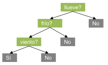
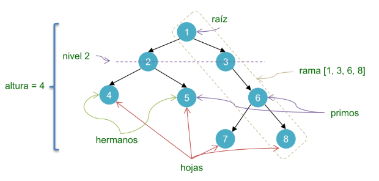
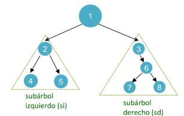
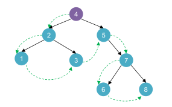
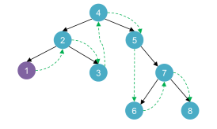
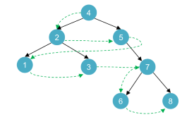

# Árboles

## El concepto de árbol
Hemos visto que a través de una estructura lineal como la lista es posible representar abstracciones tales como un grupo de elementos donde, a lo sumo, tienen una relación de orden lineal. Las estructuras de pila y cola incorporan un condimento adicional a esta relación de orden, un concepto básico de prioridad o jerarquía entre sus elementos. Es cierto que podemos modelar otro tipo de relaciones aplicando ciertos cálculos basados en los índices de estas estructuras lineales indexadas, pero veremos ahora otra forma más natural de representarlas.

Imaginemos que una organización nos solicita diseñar una estructura que permita almacenar el organigrama de la misma, la información de todo el personal y sus relaciones en términos de autoridad. Tendremos entonces relaciones de tipo _responde a_, _tiene autoridad sobre_, etc. Estas relaciones podrían ser modeladas naturalmente a través de una estructura de árbol.


Podremos encontrar otros ejemplos donde es útil la estructura arbórea:
- Representar flujos de procesos de decisión
- Optimizar la búsqueda sobre estructuras lineales
- Representar estructuras jerárquicas como taxonomías o clasificaciones



Un ejemplo de árbol de decisión que suele utilizarse como modelo predictivo de machine learning. Cada nodo representa una pregunta que tiene respuesta un conjunto de respuestas posibles y en cada subárbol se concentran las observaciones que cumplan con las condiciones de las respuestas acorde a cada pregunta. Por ejemplo, la hoja con etiqueta Sí tendrá instancias donde se registra que llovió, hizo frío y hubo viento.

> El árbol es una estructura que permite representar un **orden jerárquico** de una colección de elementos.

## Definiciones

Un árbol `T` es un conjunto finito de cero o más nodos `(v1, v2, …, vn)` donde:
- existe un nodo especial llamado nodo raíz.
- los nodos restantes se particionan en `m ≥ 0` conjuntos disjuntos `T1, T2, …, Tm`,donde cada `Ti` es un árbol con el nodo raíz como **ancestro directo**.

Un bosque es un conjunto de árboles `T1, T2, …, Tn`.

Un árbol se compone de:
- nodos o vértices
- arcos o aristas

Veamos algunas otras definiciones.



En este ejemplo vemos un conjunto de nodos, etiquetados del 1 al 8, conectados a través de aristas con dirección descendente. Esta dirección representa la relación _es ancestro directo de_. El nodo raíz (1) es ancestro directo de los nodos 2 y 3, pero también es un ancestro común a todos los nodos restantes.

En una relación de orden jerárquico se podría decir que **el nodo 1 es predecesor de todos**, mientras que el nodo 3 es predecesor del 6. Los nodos 2 y 3 son **descendientes directos** del nodo 1. 

> Una **rama** es una secuencia de nodos conectados que comienza con el nodo raíz y finaliza en una hoja.

Otra forma de describirlo sería que el árbol propuesto tiene un nodo raíz (1) y dos **subárboles**:



> Todo nodo tiene un único nodo **ancestro directo**, a excepción del nodo raíz que no lo tiene.

> Los nodos que no tienen descendientes se los denomina **hojas**. En algunos tipos de árboles puede existir el concepto de **árbol vacío**, es decir, un árbol sin nodos.

La cantidad máxima de descendientes directos que puede tener un nodo está determinada por la aridad del árbol:
- **Árbol binario**: máximo 2 descendientes directos por nodo
- **Árbol ternario**: máximo 3 descendientes directos por nodo
- **Árbol n-ario**: sin límite de cantidad de descendientes directos por nodo

Los niveles de un árbol se calculan a partir del **nodo raíz**, el cual se ubica en el **nivel 1** del árbol. Sus descendientes directos se encontrarán en el nivel 2 y así sucesivamente. Esto se relaciona con la **altura de un árbol**, la cual se define a partir de **la cantidad de niveles que tiene el árbol**, siendo lo mismo que **la longitud de la rama más larga del árbol**. En los casos donde exista el concepto de árbol vacío, su altura sería 0.

## Implementaciones
Analicemos algunas formas de implementar un árbol en lenguaje Python.

### Estructura con recursión directa


Esta forma representa un **árbol binario**, ya que permite hasta un máximo de 2 subárboles por nodo. Nos apoyamos en una estructura que combina el dato del nodo con los árboles descendientes izquierdo y derecho. El dato del nodo puede ser un tipo primitivo, como la etiqueta numérica en `int` de un nodo, o bien, un tipo de dato abstracto que contenga la etiqueta dentro. Suele ser común utilizar estructuras etiquetadas para facilitar la identificación de los nodos dentro del árbol. 

Por ejemplo, si estuviésemos modelando un mapa de contagios de un virus, donde cada nodo representa un paciente y los descendientes directos a las personas que contagió, probablemente la _etiqueta_ para identificar cada nodo sería un número de historia clínica del paciente. 

> La **etiqueta de un nodo** debería poder representar a cada nodo de forma simple y única para luego facilitar operaciones de búsqueda, edición y eliminación dentro de la estructura.

```python
from typing import Generic, Optional, TypeVar

T = TypeVar('T')

class ArbolBinario(Generic[T]):
    def __init__(
        self, 
        dato: T, 
        si: Optional[ArbolBinario[T]] = None, 
        sd: Optional[ArbolBinario[T]] = None
    ):
        self.dato: T = dato
        self.si: Optional[ArbolBinario[T]] = si
        self.sd: Optional[ArbolBinario[T]] = sd
```

Esta estrategia de implementación utiliza una estructura con **recursión directa**, donde se establece el dato genérico de tipo `T` que almacena la información del nodo y los subárboles izquierdo y derecho en los atributos `si` y `sd`, respectivamente. La representación de una **hoja** se logra determinando en `None` a los subárboles.

Si bien es suficiente para definir un árbol binario, sucede que es complicada para representar la abstracción de un **árbol vacío**. Veamos otra forma de implementarlo que la soporte.

### Estructura con recursión mutua

Una estructura alternativa sería utilizando dos abstracciones, una para los nodos y otra para el árbol en sí. De esa forma es más sencillo modelar la abstracción de **árbol vacío** ya que permite _anular_ la raíz de un árbol con `None`.

```python
from typing import Generic, Optional, TypeVar

T = TypeVar('T')

class ArbolBinario(Generic[T]):
    class NodoAB(Generic[T]):
        def __init__(
            self, 
            dato: T, 
            si: Optional[ArbolBinario[T]] = None, 
            sd: Optional[ArbolBinario[T]] = None
        ):
            self.dato: T = dato
            self.si: ArbolBinario[T] = ArbolBinario() if si is None else si
            self.sd: ArbolBinario[T] = ArbolBinario() if sd is None else sd
            
    def __init__(self):
        self.raiz: Optional[ArbolBinario.NodoAB[T]] = None

    def es_vacio(self) -> bool:
        return self.raiz is None
```
La clase genérica `ArbolBinario` ahora tiene un constructor que sólo permite instanciar **árboles vacíos**, que se representan con un único atributo `raiz` asignado a `None`. Si necesitamos construir un nodo del árbol, recurrimos a otra clase `NodoAB` que contiene tanto el dato del nodo en su atributo `dato` y los subárboles descendientes en sus atributos `si` y `sd`. Luego, el objeto de tipo `NodoAB` es asignado al atributo `raiz` de un objeto `ArbolBinario`.

En esta estrategia utilizamos entonces una estructura con **recursión mutua**, donde `ArbolBinario` se compone opcionalmente de un `NodoAB`, mientras que `NodoAB` se compone de 2 objetos de tipo `ArbolBinario`. Es importante notar que el _caso base_ de la estructura recursiva es el _árbol vacío_, donde termina la recursión.

Dado que optamos por _encapsular y ocultar_ la clase `NodoAB`, para generar un árbol no vacío, podríamos definir un **método constructor** estático así:

```python
@staticmethod
def crear_nodo(
    dato: T, 
    si: Optional[ArbolBinario[T]] = None, 
    sd: Optional[ArbolBinario[T]] = None
) -> ArbolBinario[T]:
    t = ArbolBinario()
    t.raiz = ArbolBinario.NodoAB(dato, si, sd)
    return t
```
Esta operación simplemente instancia un nuevo objeto de `ArbolBinario` (árbol vacío) en `t` y luego le asigna como raíz un objeto de `NodoAB` con la información necesaria a almacenar en ese nodo. Incluso, se podrían pasar subárboles completos para asociar como subárbol izquierdo y derecho.

### Atributos adicionales

En ciertas situaciones podríamos necesitar implementar a nuestra estructura con elementos adicionales que nos faciliten algunas operaciones. Esto dependerá del problema a resolver y como toda decisión de diseño tiene sus ventajas y desventajas. En general, incorporar algún elemento adicional a la estructura básica servirá para mejorar el rendimiento de algún comportamiento, afectando el rendimiento o complejidad de otro.

#### Vincular a ancestro directo

Una opción sería agregar una referencia al nodo antecesor inmediato para facilitar la búsqueda o recorrido inverso del árbol a partir de un nodo no raíz.


Esta versión tiene como desventaja el mantenimiento adicional necesario al momento de **modificar el árbol**, donde se debe no sólo reemplazar referencias a subárboles sino también al nodo predecesor.

```python
class ArbolBinario(Generic[T]):     
    def __init__(self):
        self.raiz: Optional[ArbolBinario.NodoAB[T]] = None
        self.antecesor: Optional[ArbolBinario[T]] = None

    @staticmethod
    def crear_nodo(
        dato: T, 
        si: Optional[ArbolBinario[T]] = None, 
        sd: Optional[ArbolBinario[T]] = None
    ) -> ArbolBinario[T]:
        t = ArbolBinario()
        t.raiz = ArbolBinario.NodoAB(dato, si, sd)
        t.raiz.si.antecesor = t
        t.raiz.sd.antecesor = t
        return t

    def insertar_si(self, si: "ArbolBinario[T]"):
        if self.es_vacio():
            raise TypeError('Arbol Vacio')
        self.raiz.si = si
        self.raiz.si.antecesor = self
```

La decisión de colocar el atributo `antecesor` en la clase `ArbolBinario` es muy relevante porque si lo hiciéramos en `NodoAB` **no tendríamos forma de asignarle predecesor a un árbol vacío**. En el ejemplo de código agregamos también cómo cambiaría la lógica de crear un árbol con un único nodo en el _método constructor_ `crear_nodo`, donde ambos subárboles vacíos deben apuntar al nuevo nodo. Y se muestra una operación básica como `insertar_si` que permite asignar un subárbol izquierdo al nodo actual.

#### Almacenar altura

Similar a como ocurre con estructuras lineales, donde el cálculo de la longitud puede resultar costoso y se puede incorporar un atributo para acelerar esta consulta, en los árboles podemos optar por almacenar la altura. El costo de calcular la altura de un árbol es también `O(n)`, lo cual puede ser importante para estructuras de gran volumen.

```python
class ArbolBinario(Generic[T]):     
    def __init__(self):
        self.raiz: Optional[ArbolBinario.NodoAB[T]] = None
        self.altura: int = 0
```
La inicialización del árbol vacío debería tener siempre altura 0, luego a medida que incorporamos nodos, cada uno de ellos debería modificar su atributo de altura para reflejar el valor real. Esto resulta en una desventaja de rendimiento si tratamos con estructuras muy cambiantes.

#### Facilitar una estrategia de recorrido

Otra alternativa sería ajustar la estructura para facilitar alguna [estrategia de recorrido](#estrategias-de-recorrido) particular. Por ejemplo, si quisiéramos tener la referencia del siguiente nodo en un recorrido [DFS inorder](#inorder), podemos inforporar el atributo correspondiente.

```python
class ArbolBinario(Generic[T]):     
    def __init__(self):
        self.raiz: Optional[ArbolBinario.NodoAB[T]] = None
        self.sig_inorder: Optional[ArbolBinario.NodoAB[T]] = None
```
El final del recorrido estaría marcado por el atributo `sig_inorder = None`.

> La mayor desventaja de estas implementaciones siempre suele ser el costo adicional referido al **mantenimiento de la estructura** frente a operaciones modificadoras o destructoras. Se incorpora complejidad al momento de manipular el árbol, más aún
si se requiere un reordenamiento de los nodos restantes. Por lo cual pueden resultar en grandes inconvenientes si se espera una frecuente actualización del árbol.

### Operaciones básicas
Veamos algunas de las operaciones básicas que podemos integrar en nuestra implementación de árbol binario.

```python
def si(self) -> "ArbolBinario[T]":
    if self.es_vacio():
        raise TypeError('Arbol Vacio') 
    return self.raiz.si

def sd(self) -> "ArbolBinario[T]":
    if self.es_vacio():
        raise TypeError('Arbol Vacio') 
    return self.raiz.sd

def dato(self) -> T:
    if self.es_vacio():
        raise TypeError('Arbol Vacio') 
    return self.raiz.dato

def es_hoja(self) -> bool:
    return not self.es_vacio() and self.si().es_vacio and self.sd().es_vacio()

```
Estas **operaciones proyectoras** nos permiten conocer aspectos básicos de la estructura. `si` y `sd` devuelven los subárboles izquierdo y derecho, respectivamente. `dato` nos entrega la información almacenada en la raíz de ese árbol. `es_hoja` nos indica si el árbol actual es una hoja, es decir, cuando no se trate de un árbol vacío y no tiene subárboles descendientes.

```python
def insertar_si(self, si: "ArbolBinario[T]"):
    if self.es_vacio():
        raise TypeError('Arbol Vacio') 
    self.raiz.si = si

def insertar_sd(self, sd: "ArbolBinario[T]"):
    if self.es_vacio():
        raise TypeError('Arbol Vacio') 
    self.raiz.sd = sd
```
Estas **operaciones modificadoras** se ocupan de alterar la estructura actual incorporando o reemplazando nuevos subárboles a la raíz del árbol actual.

```python
def altura(self) -> int:
    if self.es_vacio():
        return 0
    else:
        return 1 + max(self.si().altura(), self.sd().altura())
    
def __len__(self) -> int:
    if self.es_vacio():
        return 0
    else:
        return 1 + len(self.si()) + len(self.sd())
```
Similar al cálculo de la longitud de una lista, donde la misma se computa sumando 1 a la longitud de su cola, la altura de un árbol se calcula con el máximo de las alturas de sus subárboles incrementado en 1 (el nodo actual). El caso base se define para el árbol vacío donde resulta con altura 0.

En árboles binarios veremos que el uso de la **recursión doble** es común para resolver ciertos problemas sobre este tipo de estructuras, necesitando invocar la recursión sobre el subárbol izquierdo y el derecho para cada instancia.

### Ejercicio: Nivel de un nodo
Implementar una operación que, dado un valor o etiqueta de un nodo, devuelva cuál es el nivel del mismo dentro del árbol.

### Ejercicio: Igualdad en árboles
Implementar la operación `__eq__()` para un árbol que permita identificar si dos árboles son iguales.

### Ejercicio: Recorrido guiado
Implementar una función recursiva que, dado un árbol binario y una lista de instrucciones ('izquierda' o 'derecha') que conforma un camino guiado comenzando desde el nodo raíz, devuelva el contenido del nodo que sea accesible utilizando el camino guiado.

## Estrategias de recorrido
Existen diversas formas de recorrer cada uno de los nodos de un árbol. Veamos las más comunes.

### Primero en profundidad - DFS
El objetivo de esta forma de recorrer un árbol es priorizar el recorrido de un subárbol antes de avanzar con el siguiente. En el caso de árbol binario, generalmente se prioriza primero recorrer el subárbol izquierdo y luego el derecho, pero este orden es trivial. Lo importante es recordar que el recorrido **DFS** (_Depth First Search_) siempre **se recorre un subárbol completo antes de recorrer el o los restantes**.

> Los algoritmos de recorrido en profundidad utilizan **recursión múltiple** y **se apoyan en la pila de ejecución**.

Podemos diferenciar los recorridos en profundidad en tres variantes que vemos a continuación. La operación de **_visita_** representa una abstracción que puede ser cualquier comportamiento sobre un nodo, sea mostrarlo, insertarlo en una lista, etc.

#### Preorder
En un recorrido **DFS preorder** primero se _visita_ el nodo raíz, luego se _visita_ en el mismo orden los nodos del subárbol izquierdo y a continuación se _visita_ en el mismo orden los nodos del subárbol derecho.



Si construyéramos una lista de nodos que represente el orden del recorrido **preorder**, el resultado sería: `[4, 2, 1, 3, 5, 7, 6, 8]`.

Una implementación clásica para nuestra clase `ArbolBinario` sería así:

```python
def preorder(self):
    if not self.es_vacio():
        visita(self.dato())
        self.si().preorder()
        self.sd().preorder()
```

#### Inorder
En un recorrido **DFS inorder** primero se _visita_ en el mismo orden los nodos del subárbol izquierdo, luego el nodo raíz y finalmente se _visita_ en el mismo orden los nodos del subárbol derecho.



Si construyéramos una lista de nodos que represente el orden del recorrido **inorder**, el resultado sería: `[1, 2, 3, 4, 5, 6, 7, 8]`. Notemos que el primer nodo del recorrido es **el más profundo a la izquierda**.

> Esta estrategia de recorrido sólo es aplicable para árboles binarios.

Una implementación clásica para nuestra clase `ArbolBinario` sería así:

```python
def inorder(self):
    if not self.es_vacio():
        self.si().inorder()
        visita(self.dato())
        self.sd().inorder()
```

#### Postorder
En un recorrido **DFS postorder** primero se _visita_ en el mismo orden los nodos del subárbol izquierdo, luego se _visita_ en el mismo orden los nodos del subárbol derecho, y finalmente se _visita_ al nodo raíz.


Si construyéramos una lista de nodos que represente el orden del recorrido **postorder**, el resultado sería: `[1, 3, 2, 6, 8, 7, 5, 4]`.

Una implementación clásica para nuestra clase `ArbolBinario` sería así:

```python
def postorder(self):
    if not self.es_vacio():
        self.si().postorder()
        self.sd().postorder()
        visita(self.dato())
```

### Primero a lo ancho - BFS
La estrategia de recorrido a lo ancho o **BFS** (_Breadth First Search_) es completamente diferente a las anteriores, ya que **se recorren los nodos de un árbol por niveles**. El primer nodo a recorrer es el nodo raíz y luego continúan los nodos del siguiente nivel, sus descendientes directos, y así sucesivamente. El orden de recorrido de cada nivel es arbitrario y suele hacerse de izquierda a derecha.



Si construyéramos una lista de nodos que represente el orden del recorrido **BFS**, el resultado sería: `[4, 2, 5, 1, 3, 7, 6, 8]`.

Esta estrategia tiene una ventaja respecto al recorrido en profundidad, si estuviéramos buscando un nodo que cumpla cierto requisito dentro de un árbol, la búsqueda a lo ancho **garantiza que se encontrará (si existiera) el nodo correspondiente más cercano a la raíz**.

A diferencia del recorrido DFS que se apoya en la pila de ejecución, para implementar este tipo de recorrido utilizaremos una cola explícita para almacenar los subárboles restantes a recorrer en cada _visita_.

```python
def bfs(self):
    def recorrer(q: list[ArbolBinario[T]]):
        if q:
            actual = q.pop()                # desencolar árbol visitado
            if not actual.es_vacio():
                visitar(actual.dato())
                q.insert(0, actual.si())    # encolar subárbol izquierdo
                q.insert(0, actual.sd())    # encolar subárbol derecho
            recorrer(q, recorrido)
            
    q: list[ArbolBinario[T]] = []
    q.insert(0, self)                       # encolar raíz
    recorrer(q)
```
Esta versión inicializa una cola (_queue_) que contiene al árbol a recorrer (el nodo raíz) y luego invoca la operación interna `recorrido` pasando como argumento a la cola. La idea es desencolar para obtener un nodo a visitar y luego encolar los subárboles del mismo en la cola. Esto se realiza repetidas veces hasta que no queden nodos en la cola.

> Dado que `q` se define dentro de `bfs` y `recorrer` es una operación interna de ella, **podríamos haber evitado pasar `q` como parámetro de `recorrer`** ya que forma parte de la [clausura](../A_Python_POO/README.md#clausura). En el código presentado hacemos su pasaje explícito simplemente para facilitar la interpretación.

Es importante notar que eventualmente la recursión termina (llega al caso base de una cola vacía) porque **en todas las instancias recursivas se desencola un nodo, pero no necesariamente siempre se enconlan los descendientes**. Las inclusiones de subárboles en la cola están condicionadas a si estamos ante un árbol no vacío.

> Dado que el recorrido **BFS** utiliza una cola explícita, su implementación resulta en una [recursión lineal de cola](../02_recursion/recursion_pila_cola.md#recursión-de-cola), la cual puede reemplazarse sencillamente en una iteración.

### Ejercicio: Generar listas de recorridos
Adaptar los diversos recorridos de árbol binario propuestos de forma que la operación de visita sea la de incoporar el dato del nodo en una lista, lo cual nos permita reflejar el orden del recorrido en una estructura lineal `list[T]`.

### Ejercicio: Recorrido bottom-up
Implementar un algoritmo que devuelva el recorrido de un árbol desde las hojas hasta la raíz, y de izquierda a derecha. El primer nodo del recorrido debería ser la hoja más profunda y a la derecha, y último nodo debería ser el nodo raíz.

### Ejercicio: Eliminar recursión en DFS
Implementar una versión de recorrido DFS inorder con recursión de cola.
